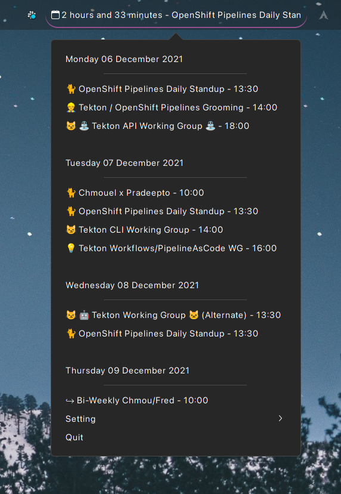

# Gnome Next Meeting applet

An applet to show your next meetings in Gnome

### Features

* Use [Gnome Online Account](https://linuxkamarada.com/en/2019/04/10/get-the-most-out-of-gnome-syncing-your-google-account/) for calendar sources.
* Make it easy to know how long you have until your next meeting.
* Detect video conference URLs allow to quickly click on it to join (Google Meet, Zoom, Bluejeans, supported).
* Shows the documents link attached to the current meeting.
* Change icons 5mn before and after meeting.
* Fully configurable.

### Screenshot



## Installation

### Ubuntu

```bash
sudo add-apt-repository ppa:chmouel/gnome-next-meeting-applet
sudo apt-get -y install gnome-next-meeting-applet
```

### Fedora

You first need to install this gnome extension to get [appindicator-support](https://extensions.gnome.org/extension/615/appindicator-support/), when this is installed you can simply do :

```bash
dnf copr enable chmouel/gnome-next-meeting-applet
dnf install gnome-next-meeting-applet
```

### Arch

Just install the package from AUR with your favourite aur installer (ie:
[yay](https://github.com/Jguer/yay))

https://aur.archlinux.org/packages/gnome-next-meeting-applet/

It depends on the
[`gnome-shell-extension-appindicator`](https://archlinux.org/packages/community/any/gnome-shell-extension-appindicator/)
extension package so you won't have to do manual instal there.

## Configuration

### Calendar sources

All calendars are configured directly in Gnome Online Account setting, it will
grab the events from there. Here is some instructions on how to setup your
online calendars in Gnome :

<https://help.gnome.org/users/gnome-help/stable/accounts.html.en>

By default it will get all events from all calendars you are subscribed to, unless you are configuring
the `restrict_to_calendar` variable.

### Applet configuration

The applet can be configured with a config.yaml yaml located in your
`$XDG_CONFIG_HOME/gnome-next-meeting-applet/config.yaml`. It gets created
automatically with default value at startup if you don't have one already.

A sample file is located here: [config.sample.yaml](./config.sample.yaml).

Settings:

* **default_icon**: The default icon when showing each meeting (default: ‣)
* **event_organizers_icon**: A map between a regexp matching the organizer to an
  icon. This allows you to easily differentiate certain type of meetings like
  the one from your team or colleagues.
* **title_match_icon**: A map between a regexp matching a tytle to an icon. This
  allows you to easily differentiate certain type of meetings by titles, like
  the recurring videogame break you are ought to deserve for your hard work.
* **max_results**: Max results to ask to google calendar api.
* **skip_non_accepted**: Skip the calendar events that you didn't accept, you
  need to configure `my_emails` setting for that.
* **my_emails**: A list of email addresses.
* **restrict_to_calendar**: Restrict to some calendar, by default it shows event from all calendars.
* **title_max_char**: The maximum length of the title
* **change_icon_minutes**: Before the meeting x minutes before the event we will
  change the icon to gently remind you to connect.
* **calendar_day_prefix_url**: The prefix URL for the day in the web calendar when clicking, by default this goes to google calendar URL.

Default icons are customizatble too:

* **icon_default_path**: the default icon, it will use the icon
                   "x-office-calendar-symbolic" from gnome theme by default.
* **icon_in_event_path**: the icon when in event, it will show a colored calendar
                    icon by default.
* **icon_before_event_path**: an icon just before an event to show something is
coming up.


### Starting it

There is a setting menu in the applet to add an autostart file to autostart it
when gnome launch or you can launch it manually from the Gnome overview
application launcher thingy.

## Compatibility

Works with Gnome as long you have this appindicator applet (which is by default on Ubuntu*)

It was tested as semi working on [polybar](https://github.com/polybar/polybar), it only shows
an icon but you can click on it to show your next meetings.
Make sure you have `tray_position = position` in your polybar config to enable it.

It was tested as well on [waybar](https://github.com/Alexays/Waybar) and shows the icon (but not the full event).

Probably works with other DE/WM supporting appindicator,
feel free to [let me know](https://github.com/chmouel/gnome-next-meeting-applet/issues/new)
if it does so I can add it to the list.

### Credits

* This package was created with [`Cookiecutter`](https://github.com/audreyr/cookiecutter-pypackage) and the
[`audreyr/cookiecutter-pypackage`](https://github.com/audreyr/cookiecutter-pypackage) project template.
* Originally inspired from the [gnome next
  meeting](https://github.com/tjwells47/gnome-next-meeting) argos based
  extension.
* Used for a while the OSX application gnome-next-meeting
  <https://apps.apple.com/us/app/next-meeting/id1017470484?mt=12> and missed it on
  Linux.
* Used code from [@GabLeRoux](https://github.com/gableroux) for evolution calendar integration - <https://askubuntu.com/a/1371087>

## License

[MIT](LICENSE.md) © [Chmouel Boudjnah](https://github.com/chmouel)
